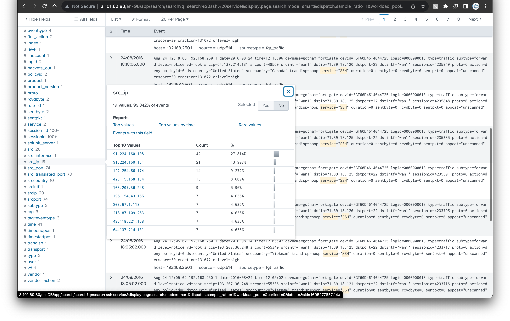
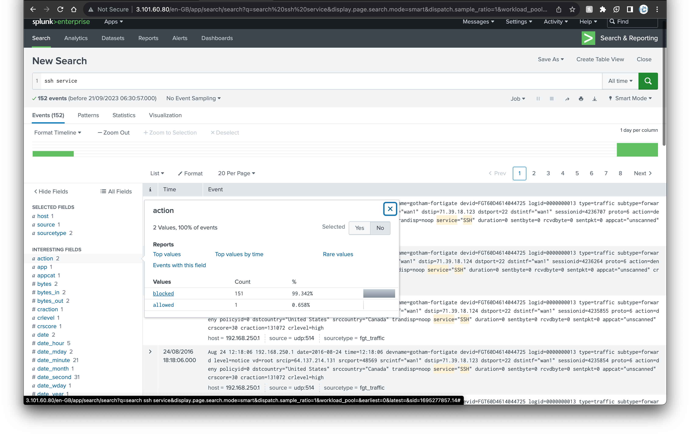
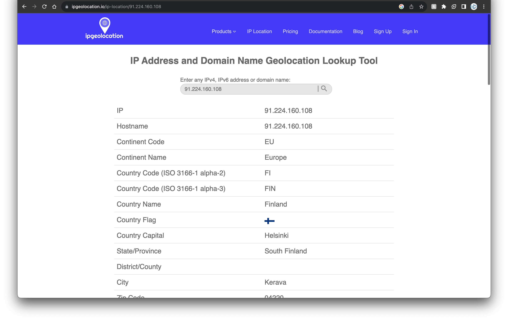

# Category
Digital Forensics
# Description
We observed a huge traffic towards our SSH Server</br> 
X: How many source IPs attempting to connect  → Number</br>
Y: The Source IP with the most connections → x.x.x.x</br>
Z: The Source IP with the most connections country → xxxxxxx</br>
W: The Firewall action taken from the security control → xxxxxxx</br>
Flag format: flag{X:Y:Z:W}</br>
Note: our company uses Fortinet FortiGate firewall.</br>
# Solution 
open the link</br> 
search for ```ssh service``` and using all time as our time range, we get the first answer from the src_ip field = 19.</br>
</br>
we also get the ip address with the most connections from the same field</br>
the firewall action is gotten by checking the action field which is blocked.</br>
</br>
to get the country of the ip with the most connections, we use an ipgeolocation service and we get finland as our answer.</br> 
</br>
piecing the puzzle together we get the flag</br>
# Flag
flag{19:91.224.160.108:Finland:Blocked}