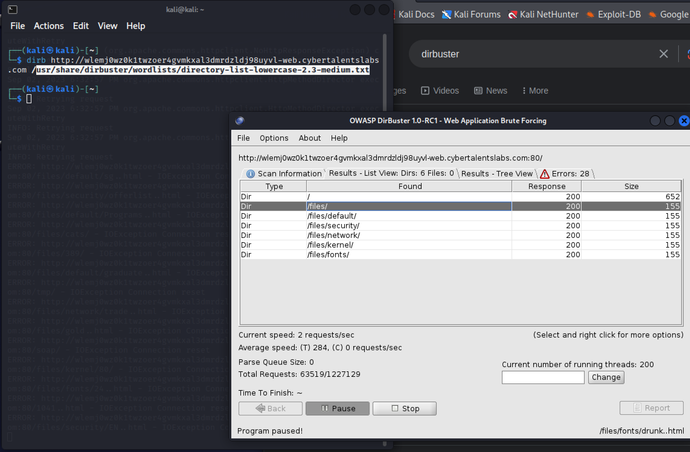
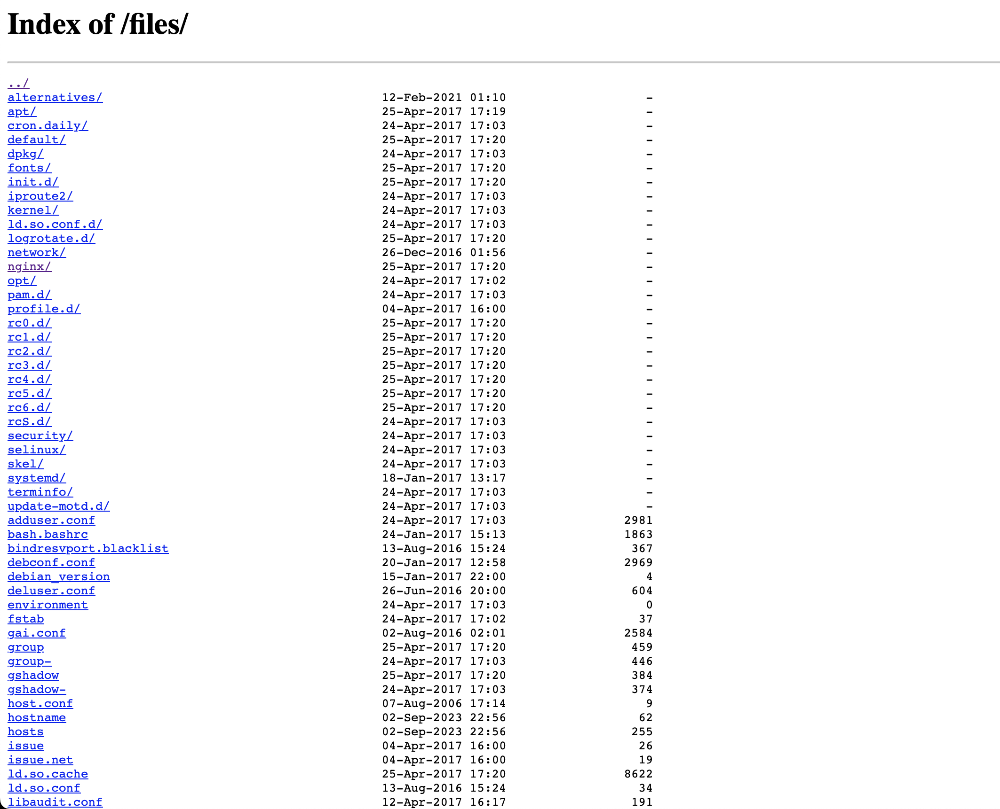
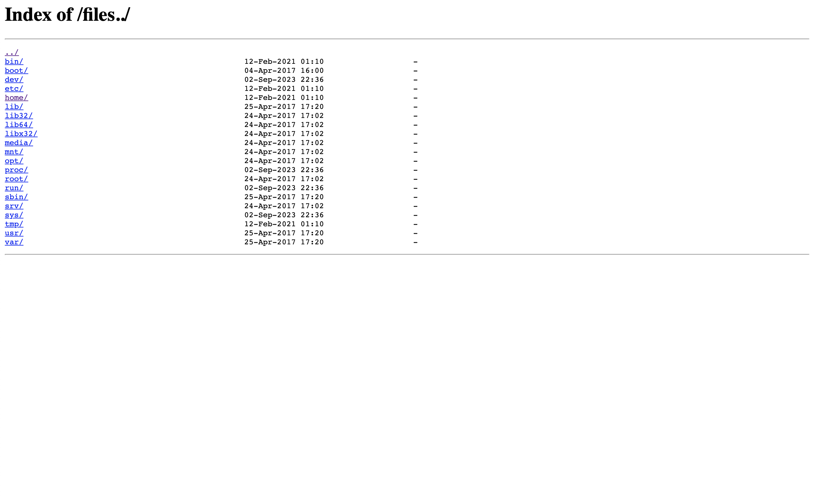
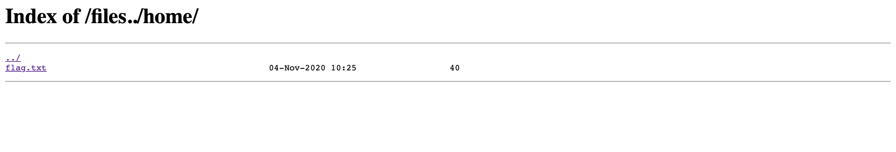
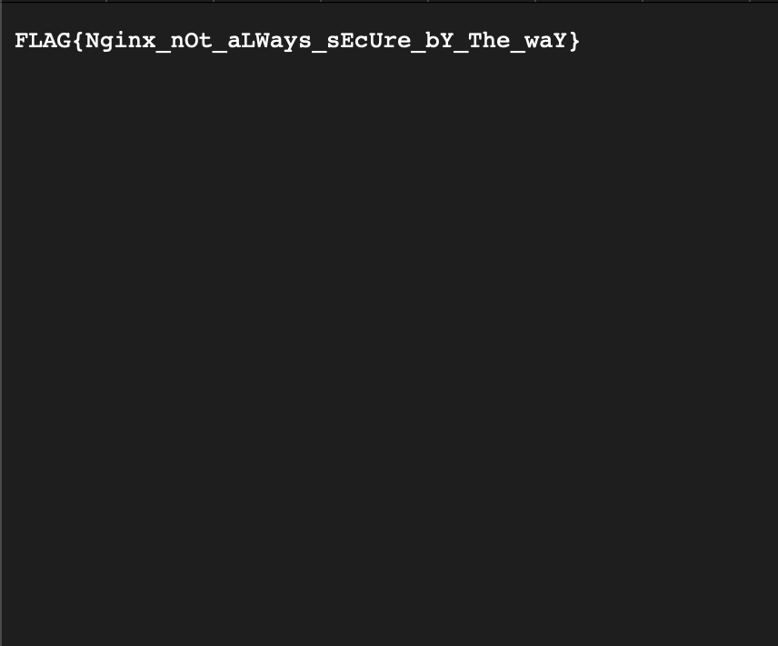

# Category
Web Security
# Description
Come back home Mr. Bean.
# Solution 
As we open the link, we get stared at in the face by mr bean. 
  
Checking the page source reveals nothing.  
we conduct a directoyr brutefroce using dirbuster 
 
we get the result shown above after a while of scanning, we decide to check out the files directory. we get: 
 
After a while we discover that the server is running nginx. And we can try a directory trasversal attack since we have the hint “home” in the question  
 
 
there's a txt file that contains the flag 
 
[writeup](https://medium.com/@ahmed-sayed/bean-challenge-cybertalents-5765747cb7ab)
# Flag
FLAG(Nginx not aLWays sEcUre bY The waY}