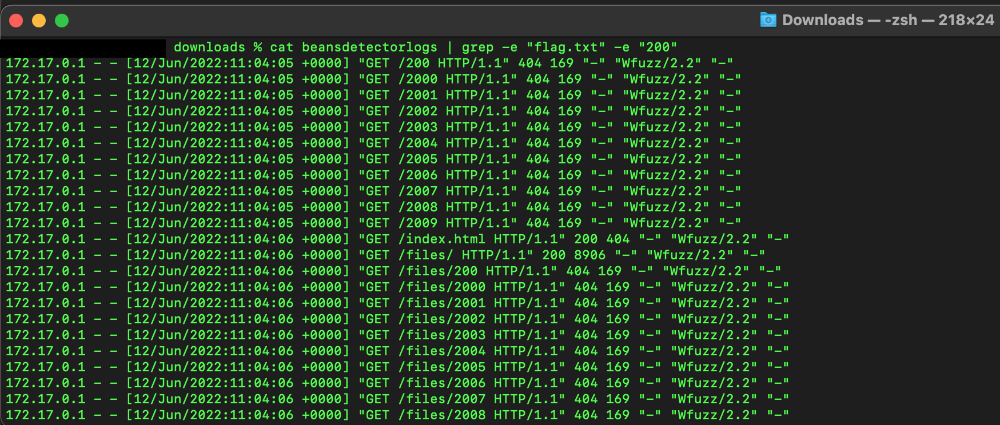
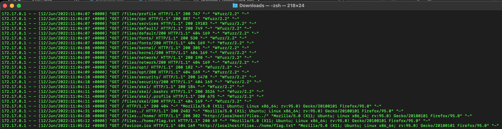

# Category
Digital Forensics
# Description
You have received the alert in your company WAF that web attack happened recently. Please check and identify the below details</br>
X : Attacker IP</br> 
Y : Name of Vulnerability Scanner used by the Attacker</br> 
Z : number of bytes in the sensitive files Leaked</br> 
W : Date and time of the Sucessful attack (xx/xx/xxxx:xx:xx:xx)</br> 
Flag format: flag{X:Y:Z:W:A}</br>
[File](./beansdetectorlogs)
# Solution 
Download the file and open it.</br> We see that it is a log file. 
We can search through it using tools like grep.</br> 
We are going to search for the flag with a response code of 200 because the question said successful attack.</br>
Using the command ```cat beansdetectorlogs | grep -e “flag.txt” -e “200”``` [link?](https://unix.stackexchange.com/questions/55359/how-to-run-grep-with-multiple-and-patterns&usg=AOvVaw10zSNan1bKOhRAj2nnqkZQ&opi=89978449)</br>
then we change the command to ```cat beansdetectorlogs | grep -e “flag.txt” -e “200 ”```</br>
you might be thinking that the space behind the 200 is a typo. No it’s not. It’s because when we run the first command we still end up with failed requests as seen below</br>
</br>
After modifying we cut the noise a bit </br>
</br>
Then we see that the fuzzer gives us most of our traffic is  wfuzz and the attacker’s ip is 172.17.0.1 the date is 12/06/2022. The size of the file is 49 bytes.</br>

# Flag
flag{172.17.0.1:Wfuzz:49:12/06/2022:11:05:12}