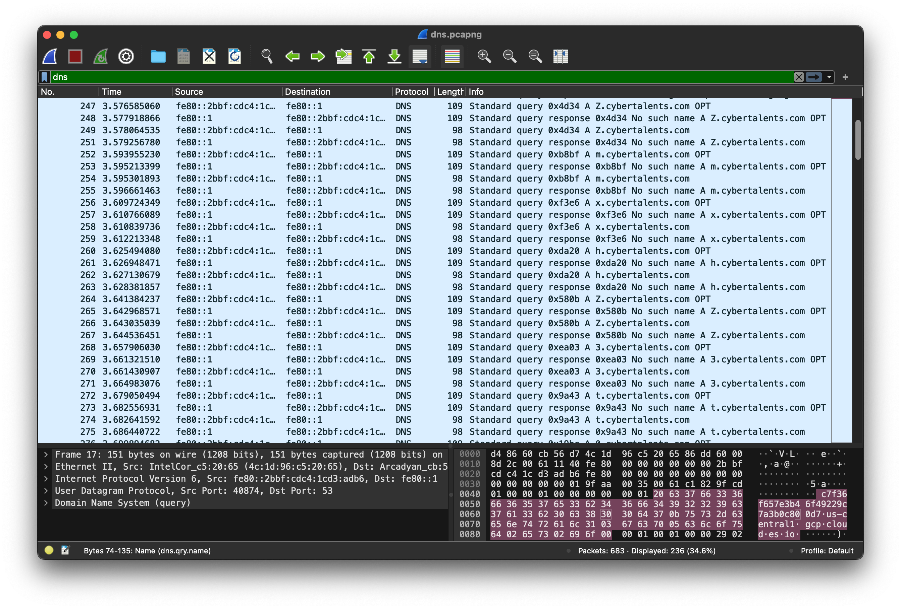
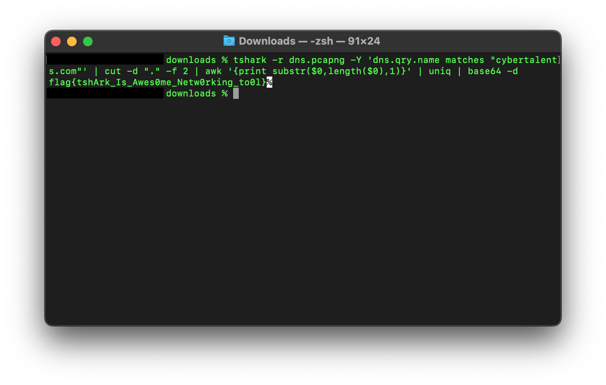

# Category

# Description
Our NMS detect a suspected traffic, your task is to investigate the captured traffic and find the anomaly reason</br>
[File](./dns.pcapng) 
# Solution 
Download the file.</br> 
It’s a PCAP Next Generation Dump File therefore we open it with wireshark.</br>
From the name of the challenge we get a hint that we should look at the dns packets.</br> 
Apply a dns filter in wireshark to see the dns packets.</br>
After skimming through them we see some letters before the cybertalents domain name as seen below.</br>
 
We use a tool called tshark. Using this command, 
```
tshark -r dns.pcapng -Y 'dns.qry.name matches "cybertalents.com"' | cut -d "." -f 2 | awk '{print substr($0,length($0),1)}' | uniq | base64 -d
```
we get our flag</br>

Seems a bit scary, innit? Do not worry we will break it down in a bit.</br>

It would be good for you to run each command individually to understand how the entire chained command works.</br>

| - this character appears often in our command. What does it do? It is known as pipe, it is a shell operator that takes the output of a command and feeds it as the input of the next command. Now that we have cleared that out of the way, let us move on to the commands.</br>

```
tshark -r dns.pcapng -Y 'dns.qry.name matches "cybertalents.com"'
```
 – this command uses tshark – a network protocol analyser, just like wireshark but uses a command-line interface instead of a GUI like wireshark.</br>
 Our first option “-r” is called infile and is used to pass our pcap (packet capture) file which is “dns.pcapng” to the program.</br>

N.B. I have encountered two types of packet capture files which are pcap and pcapng. Pcap - packet capture and pcapng - packet capture next generation. Learn more here.</br>

The second option “-Y” is a display filter which shows only particular packets. Our filter here is “'dns.qry.name matches "cybertalents.com"'” which shows only dns query packets that contain cybertalents.com</br>

```
cut -d "." -f 2
```
the cut command cuts bytes, characters, or fields from each line of a file and displays them on the terminal. The “-d” option selects the delimiter. In our case it is a full stop (.).</br>
 
The final option “-f” is called the list which specifies fields separated by the initial field delimiter.</br>

```
awk '{print substr($0,length($0),1)}'
```
awk command is used for pattern scanning and processing. This command prints out the last character in each line.</br>

```
Uniq
```
it is a command line utility that filters out repeated lines in a file.</br>

```
base64 -d
```
the final string after our text processing is in base64 so the option “-d” is to decode it to plain ascii then we get our flag.</br>


# Flag
flag{tshArk_Is_Awes0me_Netw0rking_to0l}
