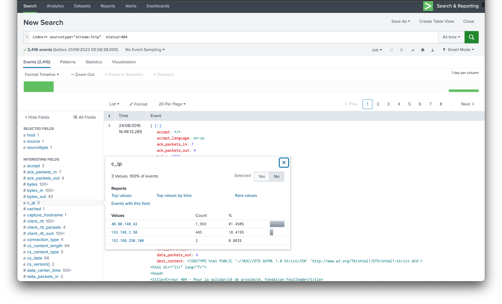
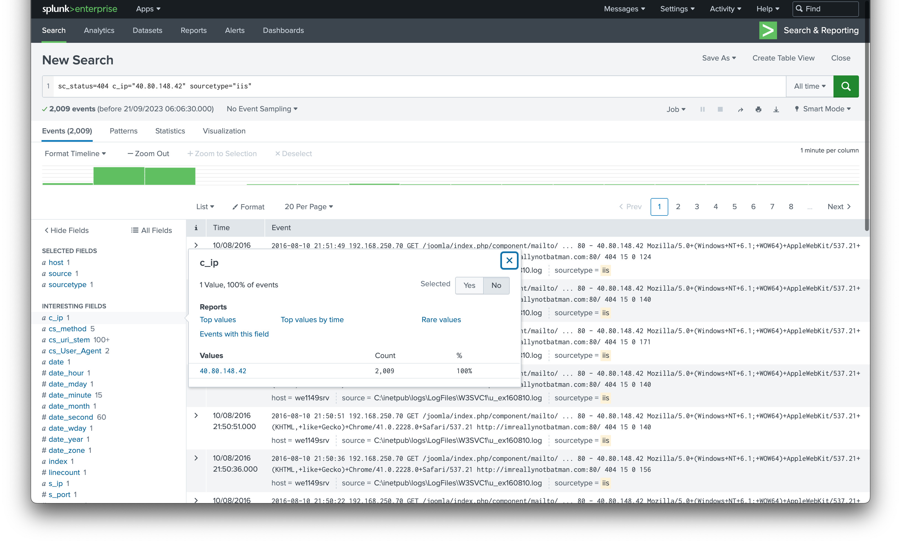
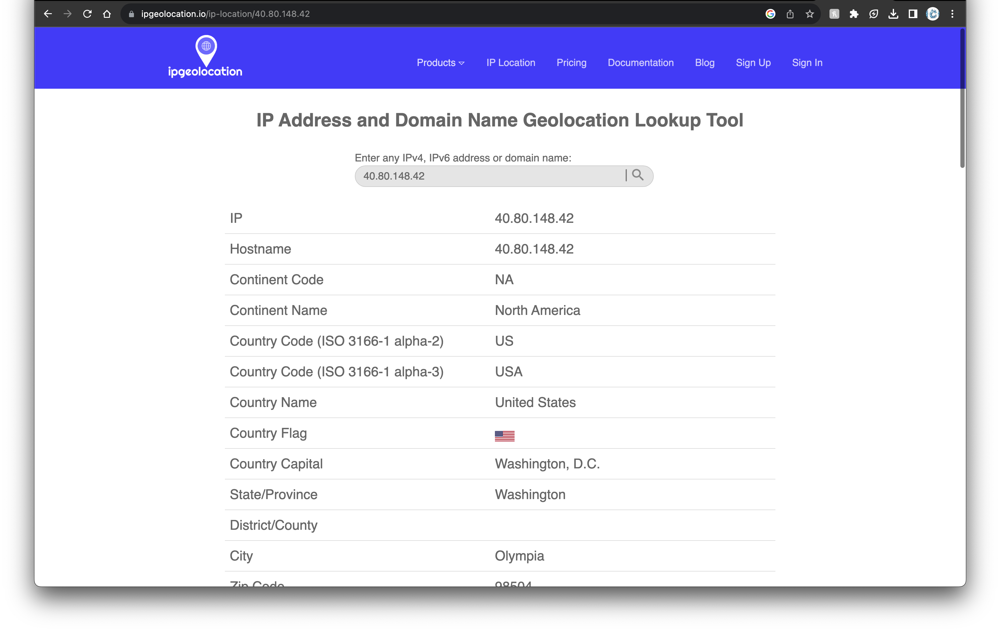

# Category
Web Security
# Description
Massive web bruteforce attack observed on our IIS server, Your lead has informed you to initiate some investigation to identify the following :</br>
X: The highest number of non existent URLs request sent by the attacker → Number</br>
Y: The Source IP → x.x.x.x</br>
Z: The attacker source country → xxx</br>
Flag format: flag{X:Y:Z}</br>
# Solution 
open the link</br>

non existent url request is always replied with an error 404 code. so we search for instances with error 404 with a time range of "all time"
checking the ip addresses associated with the responses, we have 2 private ips and a public ip (40.80.148.42) as seen below. The public ip has the highest anount of 404 response codes which is odd. so we add it to our search query.</br>

</br>

we modify our search to include iis servers, using ```sc_status="404" c_ip="40.80.148.42" sourcetype=iis```</br>
 
we get the highest number of 404 reponses which is 2009</br>

</br>

then we use an ip geolocator to confirm the location the ip originates from, which is usa</br>

</br>

putting all the pieces of our puzzle together, we get our flag</br>

# Flag
flag{2009:40.80.148.42:USA}