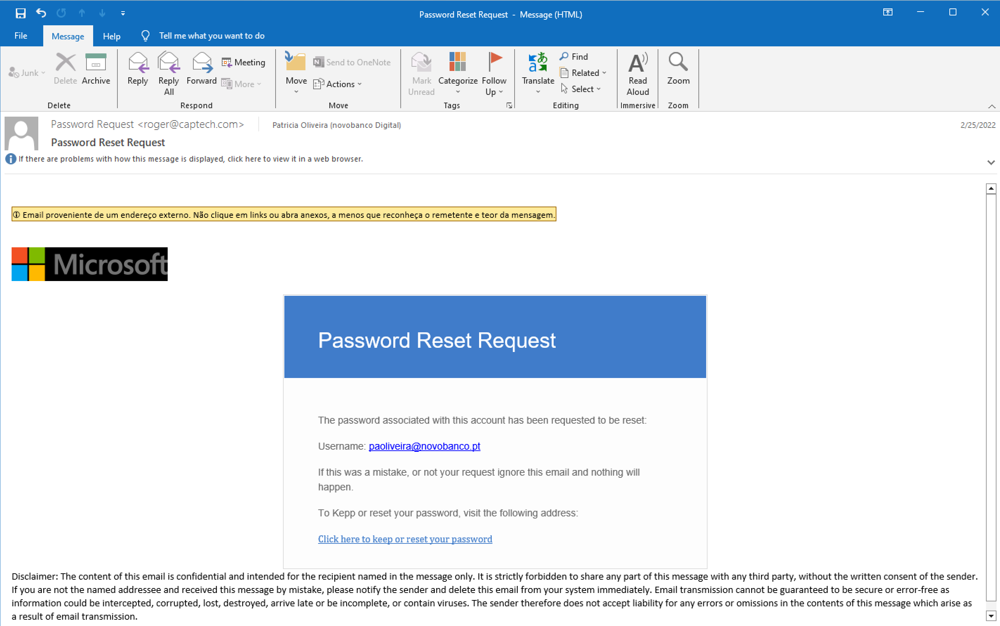

# Category
Digital Forensics
# Description
You have received the email below,  Please examine the email and answer the below questions
Follow the below format in order to submit the flag
X• The sender mail ID
Y: The date that user received the email (D/MM/YYYY)
Z• The domain name of associated URL on mail body (ABC.com)
W: Do you think this Email more likely to be legitimate or suspicious, add L For legitimate or S For suspicious
Flag{X:Y:Z:W}
[File](./passreset.msg.zip)
# Solution 
Download the file. 
Unzip the file. The password is “infected” 
Open the .msg file with an email client like outlook on windows 
 
Sender mail id is roger@captech.com  
date received: 2/25/2022  
domain name: attemplate.com(this was gotten by hovering the cursor on the link that was in the email)  
I think it is suspicious because of the spelling errors and the sender’s email. It’s just giving off red flags  
# Flag
Flag{roger@captech.com:25/02/2022:attemplate.com:S}