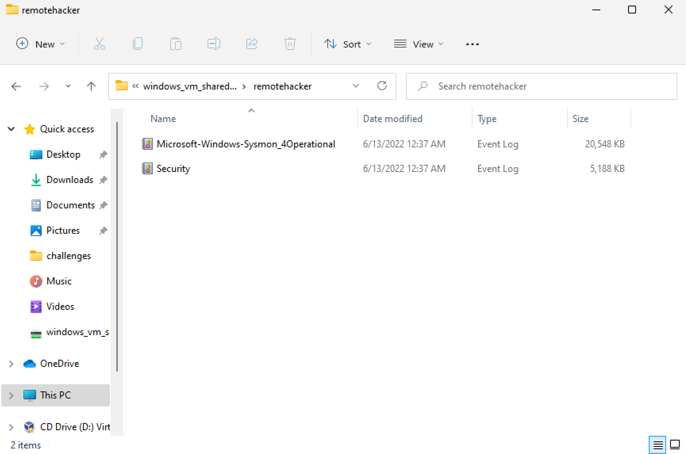
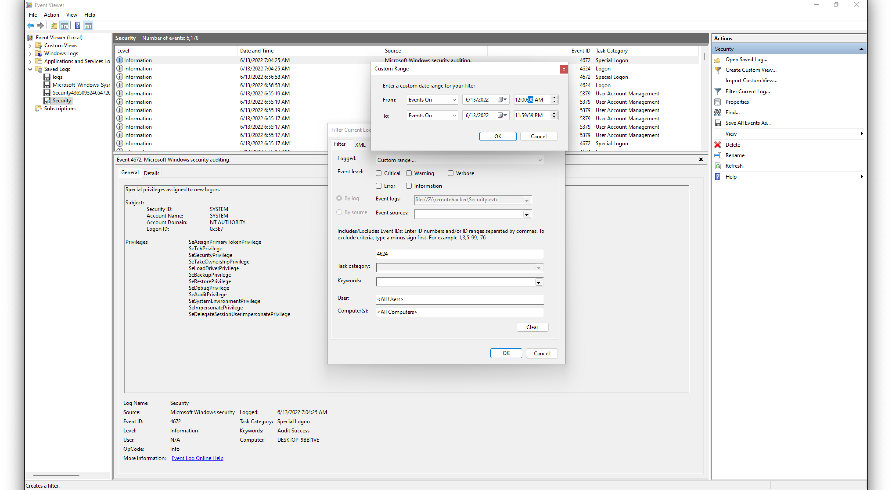
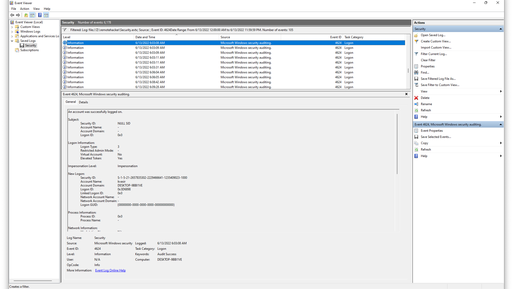
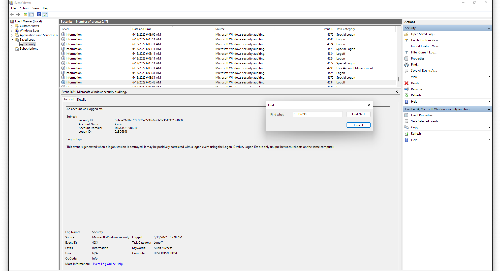
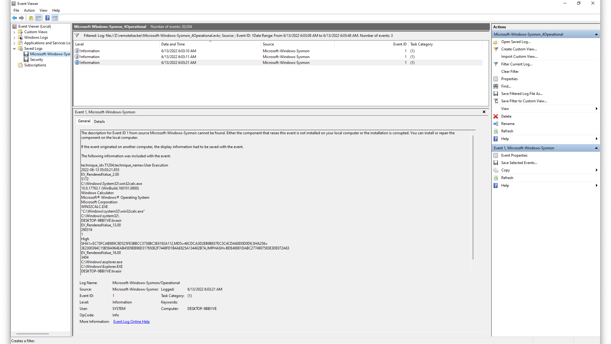

# Category
Digital Forensics
# Description
Our SoC L1 reported that she received alert of suspicious login detected by company user “Kvasir” on 13/06/2022. 
Please do check and return by your analysis: 
X: Session Duration spent by the attacker on the system (HH:MM:SS) 
Y: The application used by the user after login (xxxx.exe) 
Z: Identify the SHA256 of this application 
W: Attacker IP address 
A: Attacker Machine host name 
Flag format: flag{X:Y:Z:W:A}
[File](./remotehacker.tar)
# Solution 
Download the file. 
Uncompress the file. It contains 2 log files. Open the security.evtx file.  
 
For this challenge, an idea of windows login codes will be needed.  
A network logon is a logon type 3 and  an event id of 4624 is generated every time there is a successful network logon. learn more [here](https://www.manageengine.com/products/active-directory-audit/learn/what-are-logon-types.html) and [here](https://learn.microsoft.com/en-us/windows-server/identity/securing-privileged-access/reference-tools-logon-types)  
So we can sort by event id then by logon type on 13/06/22 for the user kvasir according to the question 
 
going through the results, we find a match at 06:03:08 am on 13/6/2022. the machine's name is Nitro with an ipaddress of 192.168.1.58 
 
we check the event log for its login id so we can see the logoff event. we find it at 06:05:48. giving a total access time of 02:40 mins 
 
our work with the security.evtx is done. time to move on to the "Microsoft-Windows-Sysmon_4Operational.evtx" file. process creation event id is 1, so we start filtering within the time range that the attacker had access to the system(06:03:08 - 06:05:48) there are 3 results but we're intrested in the one at 06:03:21. we can identify the application to be WIN32CALC.EXE and the sha256 value to be 3E2300394C15B59A964EAB45D9EB96D317650E2F7448FD1B4AE825A134402B7A

gathering the tidbits, we get the flag
# Flag
flag{00:02:40:win32calc.exe:3E2300394C15B59A964EAB45D9EB96D317650E2F7448FD1B4AE825A134402B7A:192.168.1.58:Nitro}
 