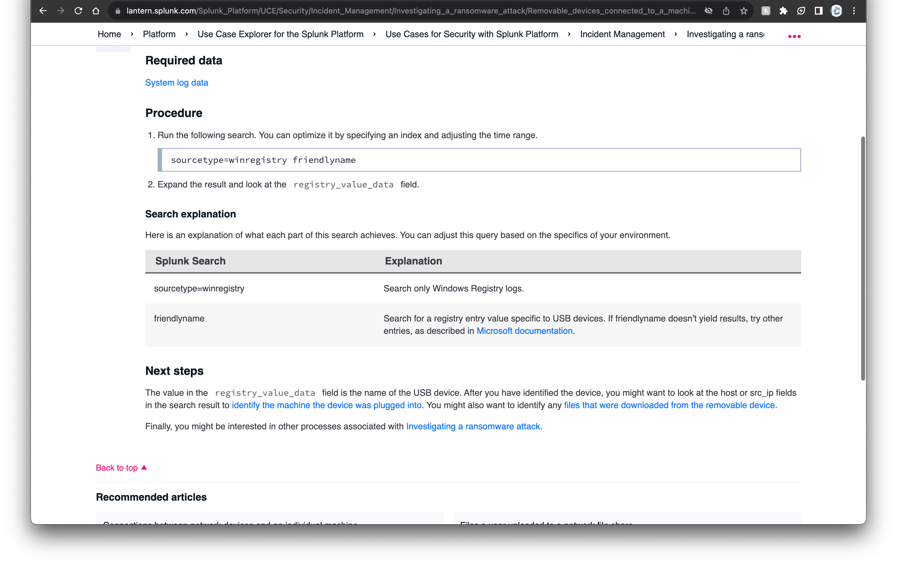
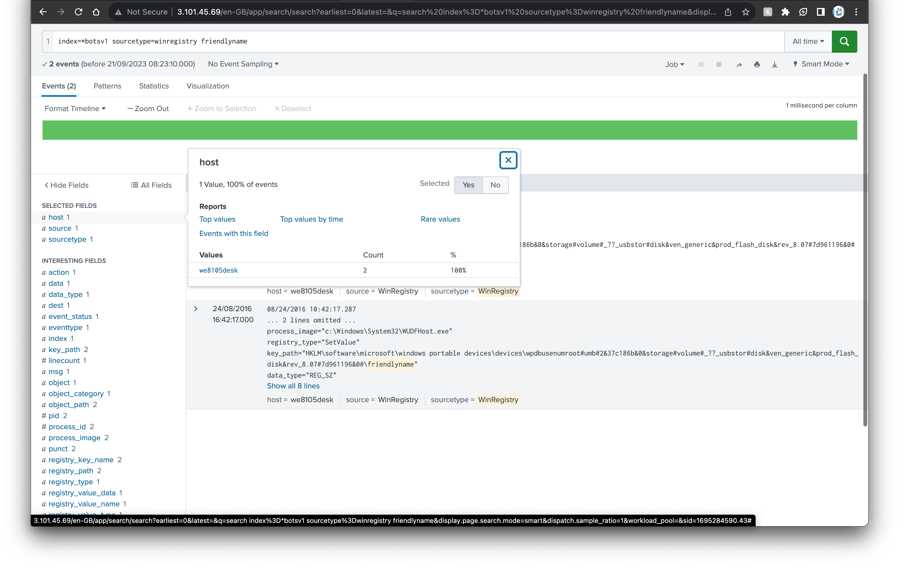

# Category
Digital Forensics
# Description
Your Team Lead ask you to develop splunk use case for detecting USB plugged on any device in your environment he shared with you also this [link](https://lantern.splunk.com/Security/Use_Cases) 
Develop the use case and answer the below questions based on botsv1 dataset  
X: Date and time when the USB plugged on device  (YYYY-MM-DD:HH:MM:SS) 
Y: The Machine name  
Z: Name of the USB device 
Flag format: flag{X:Y:Z:A} 
# Solution 
clicking on the link given to us in the description and searching for 'usb' leads us to this [link](https://lantern.splunk.com/Splunk_Platform/UCE/Security/Incident_Management/Investigating_a_ransomware_attack/Removable_devices_connected_to_a_machine) 
 
using the recommended search query gets us the image below from which we can get the time the device was plugged in and we can also get the host name by clicking on the host field of the results. 
 
and checking the 'registry_value_data' field gives us the name of the usb device 
 
assembling the answers we got gives us the flag 
# Flag
flag{2016-08-24:10:42:17:we8105desk:MIRANDA_PRI}