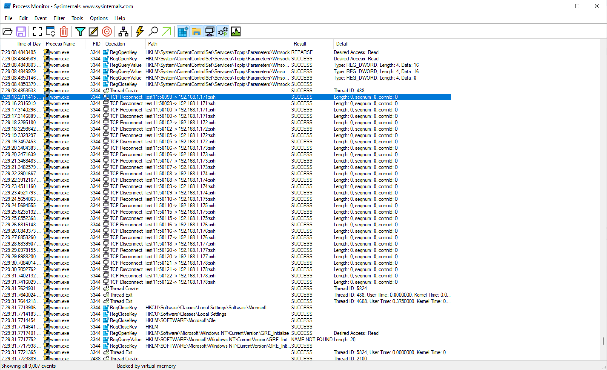

# Category
Digital Forensics
# Description
Our EDR has flagged suspicious traffic from production endpoint, after reviewing the respective process generating the traffic and another alert has been alerted “Worm Detected” in our SIEM. 
You decided to escalate the case to IR team to further investigate and answer the below questions  
Questions:
What is the range of worm spreading (x.x.x.x/xx) ? 
Destination target port of the attack (XX)? 
How many hosts might be affected by the worm (XX)? 
Flag format: flag{Answer1:Answer2:Answer3}. 
[File](./worm.zip)
# Solution 
Download the file and uncompress it. The password is “infected”.  
You need to download process monitor – it is a monitoring tool for Windows that shows real-time file system, Registry and process/thread activity. [link](https://download.sysinternals.com/files/ProcessMonitor.zip) 
Run process monitor and set a filter to record only activity from the worm executable as shown below. 

Start the capture, after a while we see some activity 
Then we see some network activity  
The first ip address contacted is 192.168.1.171 via ssh. If we let it run for a while we’ll see that the last ip address contacted is 192.168.1.256.  

<!--That gives us the answer to all our questions – how? 
 First we write down the ip address in binary  -->
Use DetectItEasy to check whether the file was packed. We can see that it was packed with py installer and it is safe to assume that there’s python code here. 

Download pyinstxtractor. We will use it to extract the compilled bytecode files code (.pyc) files 
 
Then we use decompyle++ to convert the .pyc files back to .py files.  
If you are confused on how to use decompyle++ follow these steps:  
download the repo or clone it  
go to folder where it was downloaded (after extracting) or cloned and open a terminal there 
enter these commands : mkdir build && cd build && cmake .. && make 

then you should have a pycdc executable in the build folder. 
Run ./pycdc (path to file)   
You should the following output 
 
Through the code we can see that the default subnet mask is 255.255.255.0 which translates to a cidr of /24 meaning our ip address range is 192.168.1.0/24 
In our earlier analysis we saw it trying to communicate via ssh which is port 22 
In a /24 network, there are 256 addresses including the router and broadcast addresses.The network activity begun at 192.168.1.171 and stopped at 192.168.1.255 which is a total of 85 addresses and we get our flag 

# Flag
Flag{192.168.1.0/24:22:85}