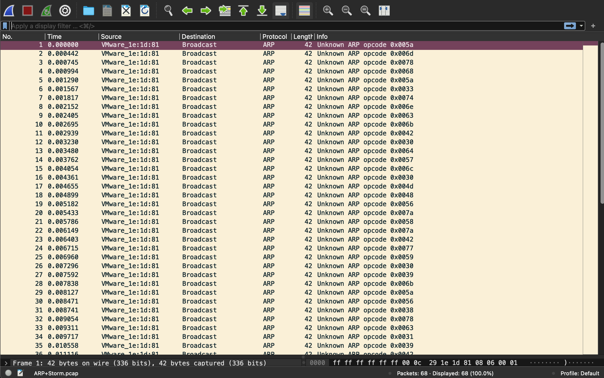

# Category
Network Security
# Description
An attacker in the network is trying to poison the arp table of 11.0.0.100, the admin captured this PCAP.
[File](./ARP+Storm.pcap)
# Solution
Open the file. 
It is a pcap file so we use wireshark. 
We see a bunch of arp packets with different opcodes. This could contain the flag.  
 

# Flag
ctf
