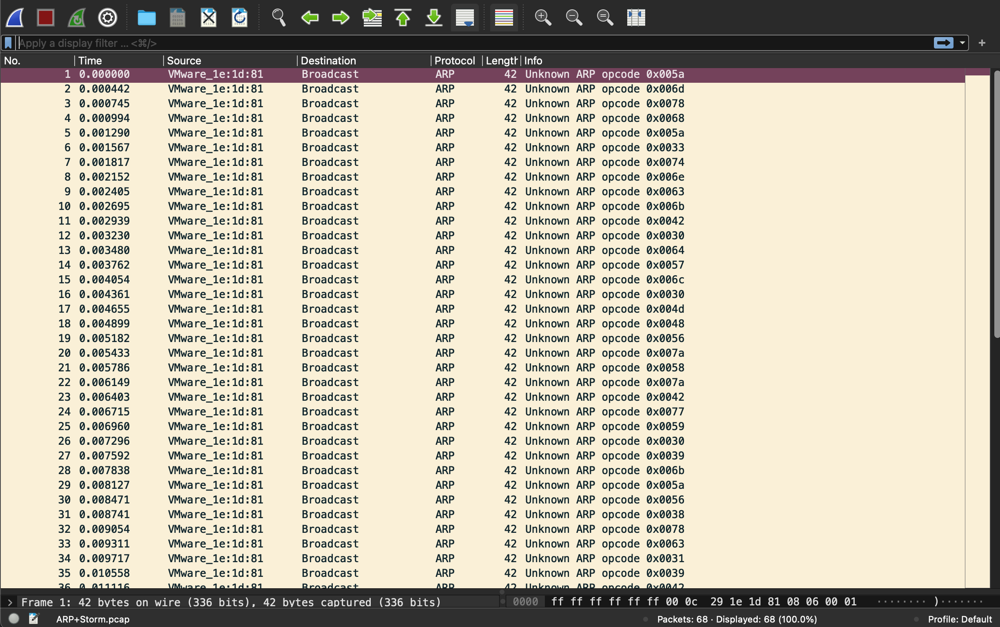
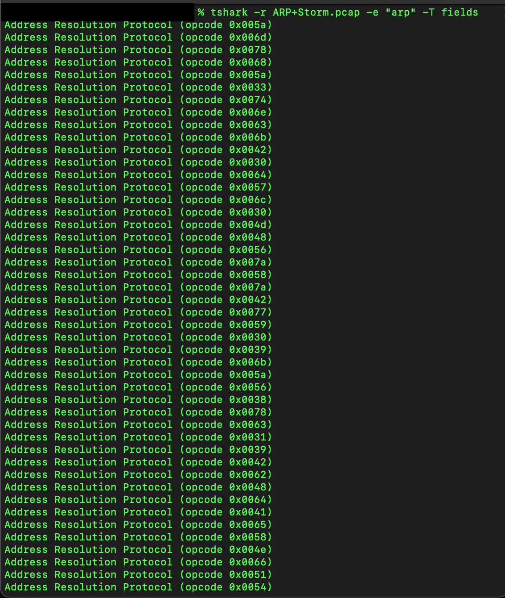
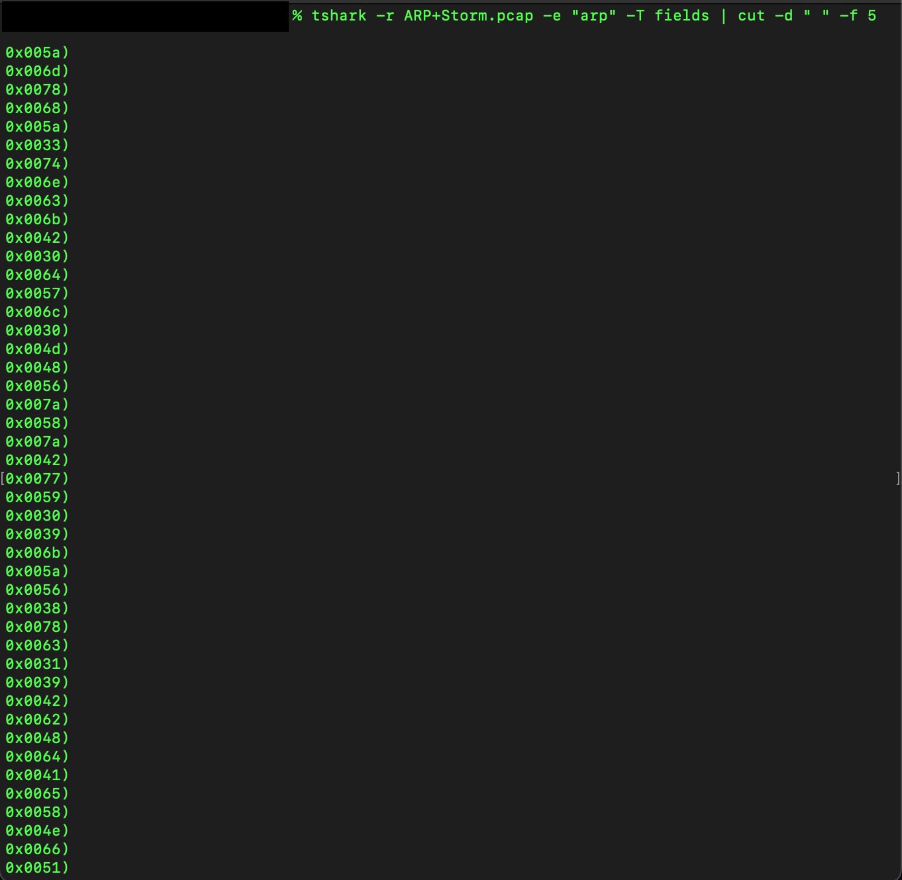
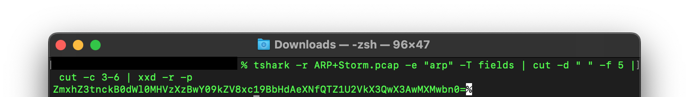
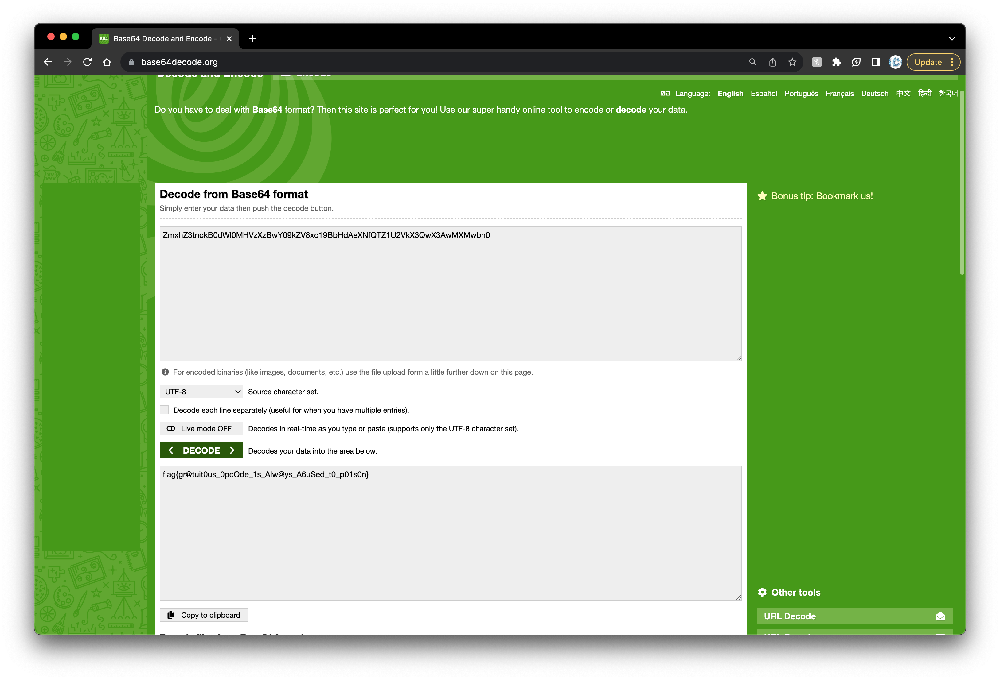

# Category
Network Security
# Description
An attacker in the network is trying to poison the arp table of 11.0.0.100, the admin captured this PCAP.
[File](./ARP+Storm.pcap)
# Solution
Open the file.</br>
It is a pcap file so we use wireshark.</br>
We see a bunch of arp packets with different opcodes. This could contain the flag. </br>
</br>
we open up our terminal for easier processing and type in this command. </br>

```tshark -r ARP+Storm.pcap -e "arp" -T fields | cut -d " " -f 5 | cut -c 3-6 | xxd -r -p ```</br>

command breakdown:</br>
tshark is a command line tool for analyzing network traffic.</br>
-r option specifies the file to read.</br> 
-e option selects the field to print which in our case is ARP.</br> 
-T option selects the format of the text output.</br>
</br>
result after running the first part of the command</br>
</br>
cut is a text manuipulating tool.</br>
 -d option uses space as a delimiter(shows what to use to group text together). </br>
 -f selects the 5th column after running this we get.</br>
</br>
result after chaining first 2 commands</br>
</br>
we use cut again to remove the unwanted characters like the '0x' and the closing bracket at the end of the text. </br>
-c option selects the characters to display. if we count the characters in the previous output we discover there are 7 characters and we make our selection (3-6) to get this:</br>
![result after chaining the first 3 commands]](./img4.png)</br>
</br>
xxd is a tool for converting hex to binary and vice versa</br>
-r option is used to convert our hex to binary </br>
-p option makes the output to be a continuous line</br>
</br>
</br>
copy the ouput from the terminal and convert it from base64. you can use [this](https://www.base64decode.org/)</br>

# Flag
flag{gr@tuit0us_0pcOde_1s_Alw@ys_A6uSed_t0_p01s0n}
