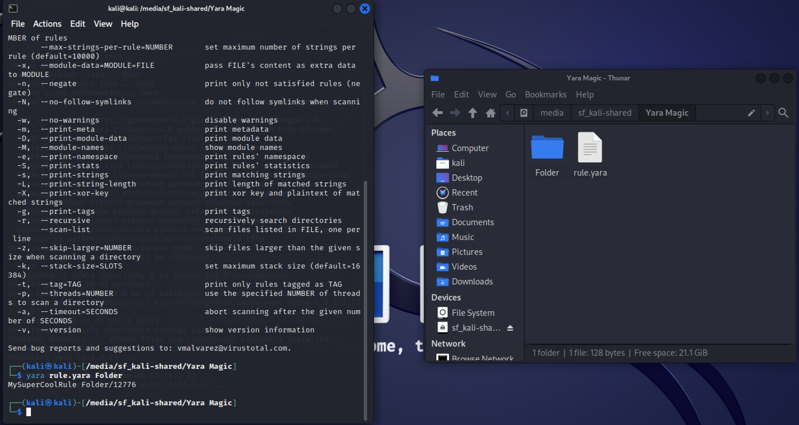

# Category
Digital Forensics
# Description
Help us!Here is a copy of a folder of ours, 
we need to scan this folder with this Yara rule and check if we have any matches!,
scan this folder with the rule and provide us with the matched filename.
[File](https://hubchallenges.s3.eu-west-1.amazonaws.com/foren/Yara+Magic.tar.gz)</br>
Flag format: FLAG{filename}</br>
# Solution
Download the file</br>
Extract the compressed folder</br>
Install yara if you don’t have it already. 
```
 sudo apt install yara
```
</br>

Open a terminal in the folder</br>
```
    Run yara [the rule name] [target ]
```

You will get the answer as shown below</br>



# Flag
flag{12776}