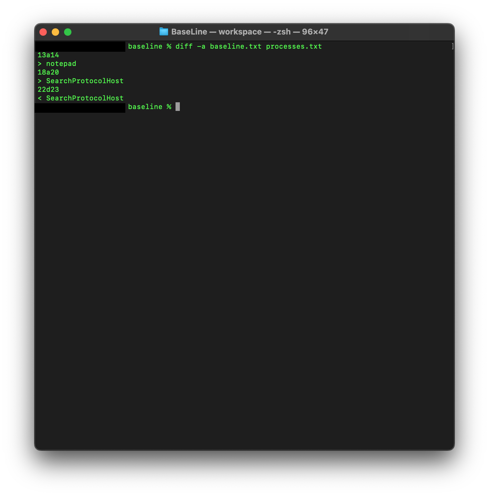
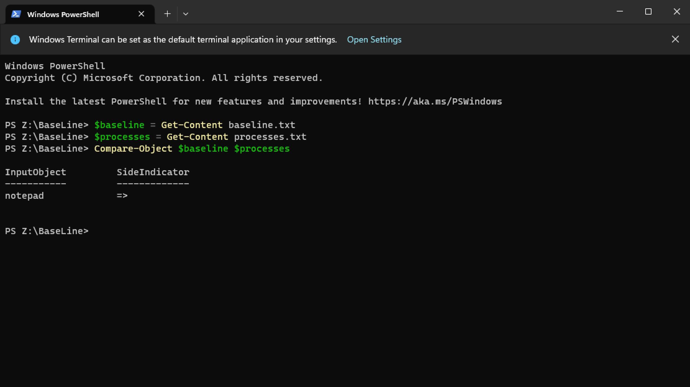

# Category
Digital Forensics
# Description
We've captured the processes on our environment, can you use your Powershell skills and compare this file with the baseline? We need to know the unwanted process.</br>
Flag format: FLAG{process name}</br>
[FILE](./BaseLine.zip)
# Solution 
extract the zip file</br>
we get 2 .txt files</br>
using a command-line tool called "diff" we can get the difference between the two files and thus our answer</br>
we run this command:</br>

```diff -a baseline.txt processes.txt ```</br>

we get:</br>
</br>

Let's take a look at what this output means. The important thing to remember is that when diff is describing these differences to you, it's doing so in a prescriptive context: it's telling you how to change the first file to make it match the second file.

The first line of the diff output contains:</br>
line numbers corresponding to the first file,
a letter (a for add, c for change, or d for delete), and
line numbers corresponding to the second file. culled from [here](https://www.computerhope.com/unix/udiff.htm)</br>
it simply tells us we need to add "notepad" to the baseline file, which means that it's not there and we should add "SearchProtocolHost" to both files however on different lines.</br>
we're looking for the different process in both files. notepad is the culprit because "SearchProtocolHost" exists on both files just on different lines but notepad on exist on the processes file. so we get our flag.</br>


using powershell(as intended)</br>
download and extract the zip file</br>
open powershell and 'cd' to the directory where the files are located. declare them as variables and compare them?</br>
using these commands, you'll get the flag</br>

```$baseline = Get-Content baseline.txt```</br>
```$processes = Get-Content processes.txt```</br>
```Compare-Object $baseline $processes```</br>

</br>
# Flag
FLAG{notepad}