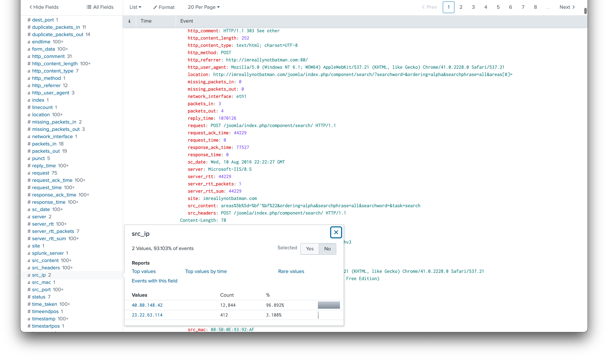
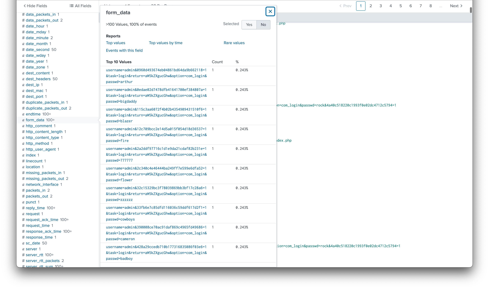
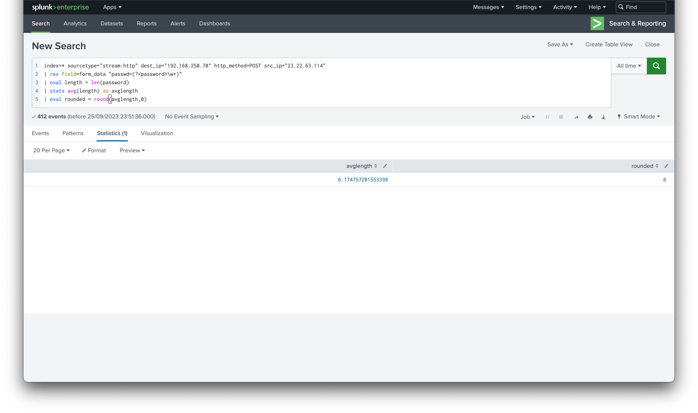

# Category
Digital Forensics
# Description
we suspect that one of our server at 192.168.250.70  was attacked by a web brute forcing attack, we need to identify:</br>
X:  What is the attacker’s IP address.</br>
Y: The Average password length (decimal number).</br>
Credentials: cybertalents/cybertalents</br>
Flag format: flag{X_Y}</br>
# Solution 
open the link</br>
using this parameter ```index=* sourcetype="stream:http" dest_ip="192.168.250.70" http_method=POST```</br>
because we're searching for requests to the ip and post requests since post is used to send info to servers.</br>
we can see two src_ips 40.80.148.42, 23.22.63.114</br>
i started with the one with the lower amount of requests-23.22.63.114</br>
</br>
checking the form-data field we can see multiple login attempts from this ip which indicates that this is our suspect</br> 
to get the average length of passwords we use this command:</br>
</br>

```index=* sourcetype="stream:http" dest_ip="192.168.250.70" http_method=POST src_ip="23.22.63.114"```</br>
```| rex field=form_data "passwd=(?<password>\w+)"```</br>
```| eval length = len(password)```</br>
```| stats avg(length) as avglength```</br>
```| eval rounded = round(avglength,0)```</br>


command breakdown can be found [here](https://medium.com/@huglertomgaw/cyberdefenders-boss-of-the-soc-v1-d38f78cef3ba)</br>
combining the answers, we get our flag.
# Flag
flag{23.22.63.114_6}