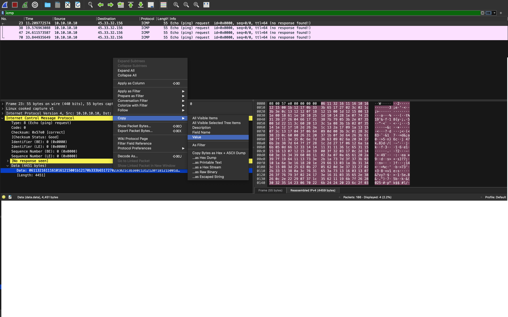
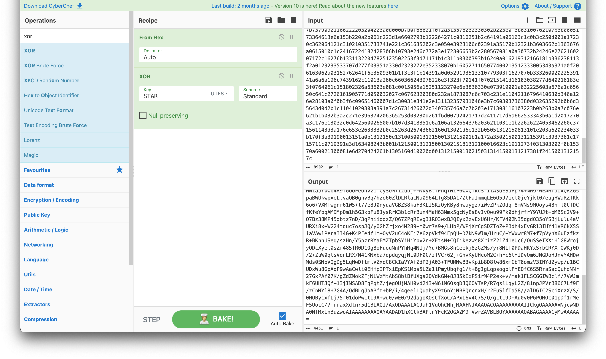
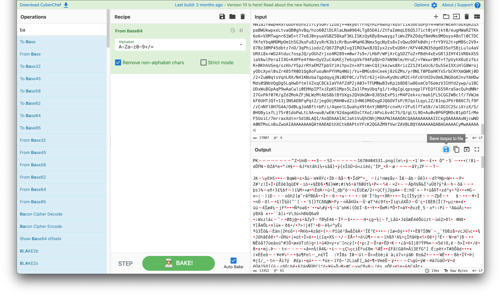

# Category
Network Security
# Description
My computer was compromised and my files were stolen and then deleted from my computer, I've captured some of the traffic, can you analyse the PCAP and try to restore any of my files?
[file](./eXodus.pcapng)
# Solution 
shoutout to yasser from the discord channel for helping me with this!</br>
open the file with wireshark</br>
there are 4 icmp packets with a packet length of 55 bytes. it might be icmp data exfiltration.</br> 
you can use tshark to get the data from the packets and save it to "output.txt" by running the following command ```tshark -r eXodus.pcapng -Y icmp -T fields -e data.data > output.txt```</br>
or
copying the data value from each packet as shown below</br>
</br>
later in the wireshark file, we see a file download via http that shows the key is "STAR"</br>
select the data from each packet and paste in [cyberchef](gchq.github.io) using "from hex" and "XOR" as the recipe. as shown below. when you put in the last packet and decode it, your output should end with an equal sign ("=") which is an indicator that it's a base64 string</br>
</br>
put all the ouputs together in cyberchef and convert from base64. you'll get an output that starts with "PK" indicating a zip file.</br>
</br> 
save the [file](./download.zip) and extract it. you'll get an image with the flag in it. </br>
# Flag
FLAG{M1gratingOutOfYourNetXWOXrk}