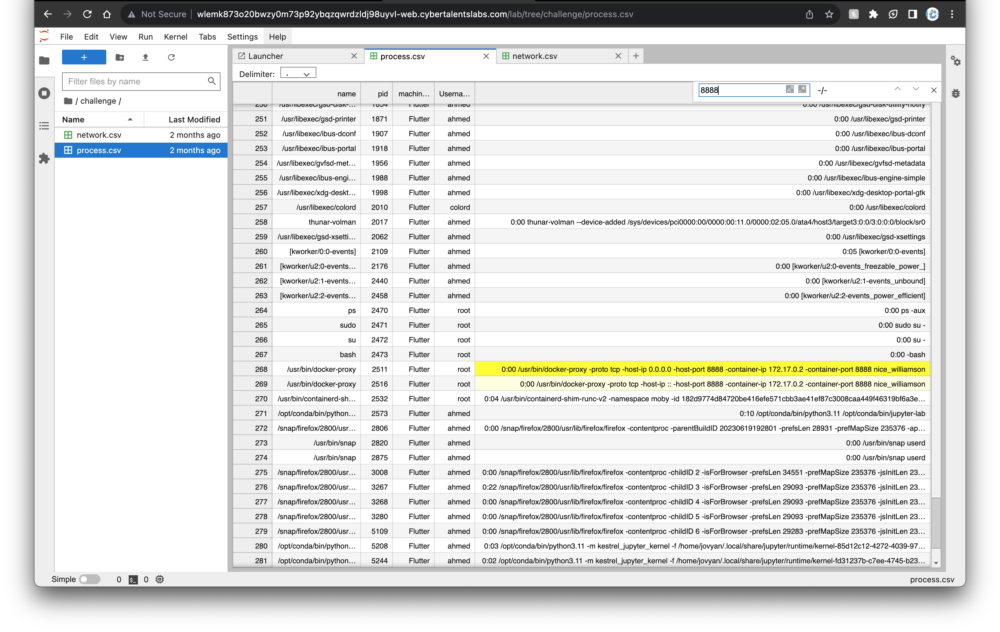

# Category
Network Security
# Description
Falcon language can guide your hunt, try to hunt the machine developed this challenge. 
Developer used the port 8888 for the system 
password: falcon 
Flag format: FLAG{host+process_Name+IP} 
# Solution 
we login to a jupyter enviroment  
I did a cmd + f search for 8888 on the process.csv file and found 2 entries and I put the corresponding values into the flag until i got an answer. bruteforcing the answer lol.  
There should be a more refined method but that will do for now. 

# Flag
flag{nice_williamson+docker-proxy+172.17.0.2}