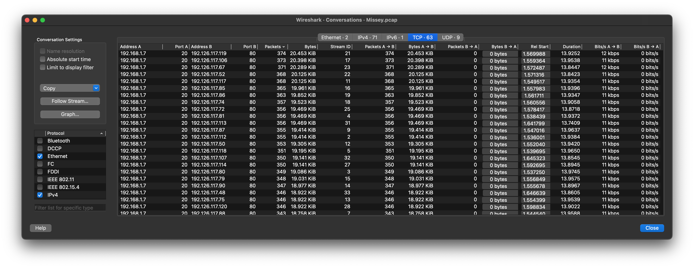
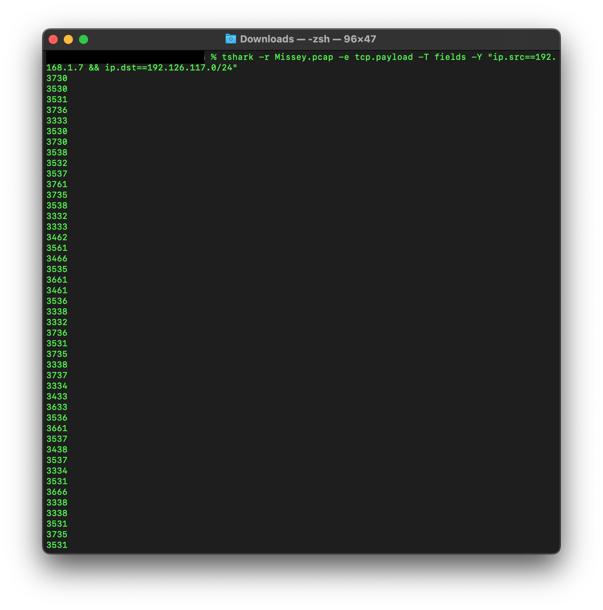
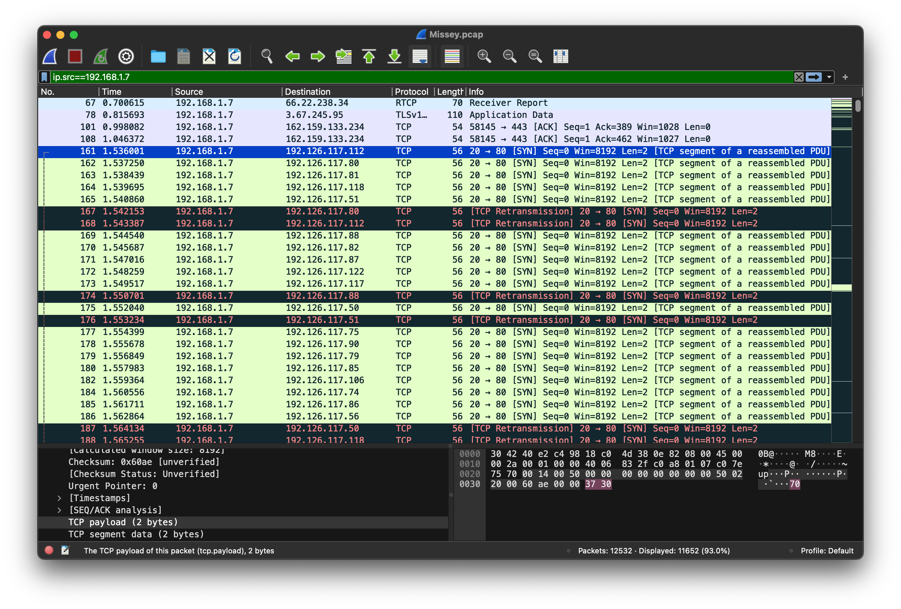
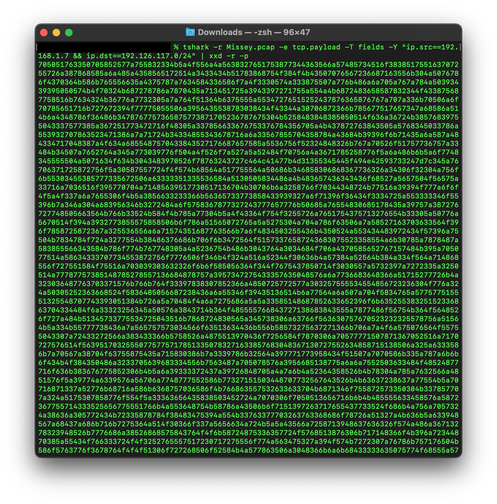
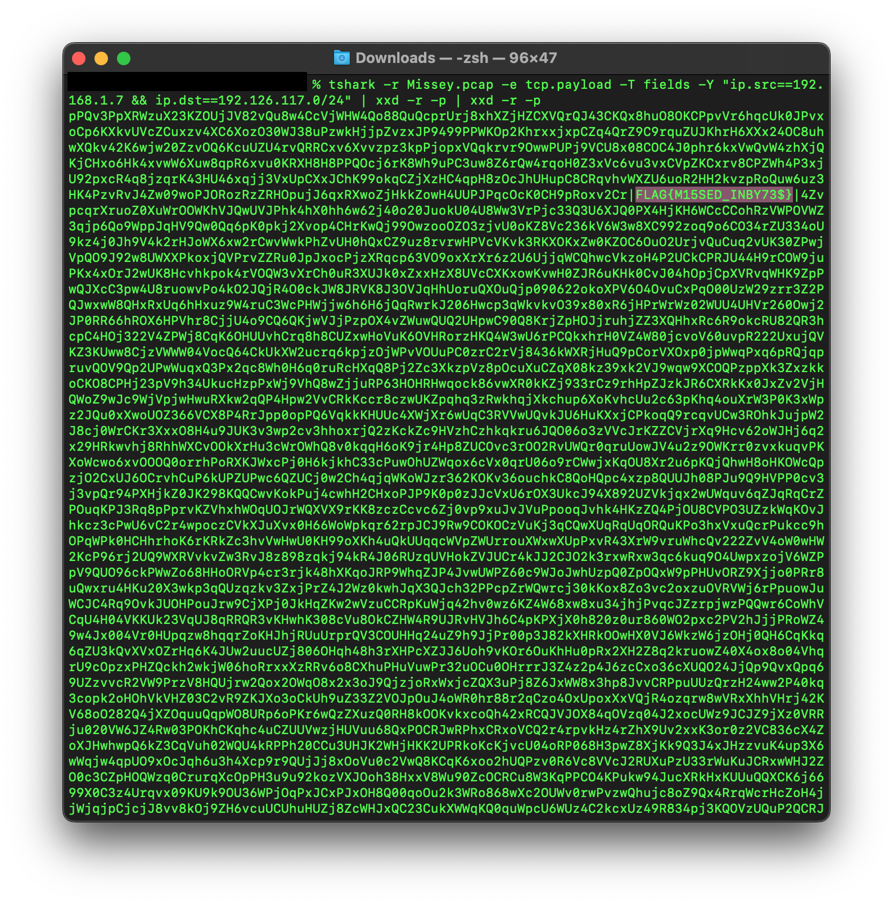

# Category
Network Security
# Description
Seems someone tried to bruteforce on IPs, so can you reveal what he hides?</br>
[File](./Missey.pcap)</br>
# Solution 
Open the file.
It's a bruteforce attack so we have to check the communication between 2 ip addresses. go to statistics and then conversations and when we click on the tcp tab, we get this</br>
</br>
we can confirm that the attack is coming from ip address 192.168.1.7 and they are attacking the entire 192.126.117.0/24 range. on closer inspection of the tcp packets. we notice that the tcp payload changes per packet so we use tshark to extract those values</br>

```tshark -r Missey.pcap -e tcp.payload -T fields -Y "ip.src==192.168.1.7 && ip.dst==192.126.117.0/24" | xxd -r -p | xxd -r -p```</br>

command breakdown:</br>
| - this character is known as "pipe". it is used for chaining commands together. it passes the output of the previous commmand as the input for the next one, like water flowing through a pipe.</br>
</br>
tshark is a command line tool for analyzing network traffic.</br>
-r option specifies the file to read.</br> 
-e option selects the field to print which in our case is the tcp payload.</br> 
-T option selects the format of the text output.</br>
-Y option is used to select our display filter. works just like typing our filter in the search box on wireshark.</br>
</br>
</br>
xxd is a tool for creating a hex dump and vice versa</br>
-r option is used to convert our hex to binary </br>
-p option makes the output to be a continuous line</br>
this done to get a hexdump. when you compare the tcp payload and the hex value on wireshark, it should match up.</br>
</br>
</br>
we find the flag in the final dump</br>


# Flag
FLAG{M15SED_INBY7$}