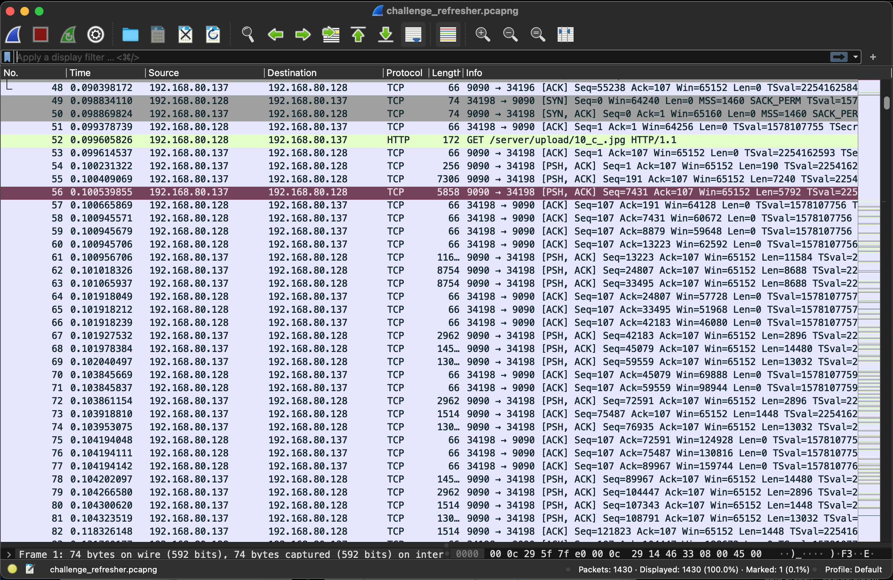
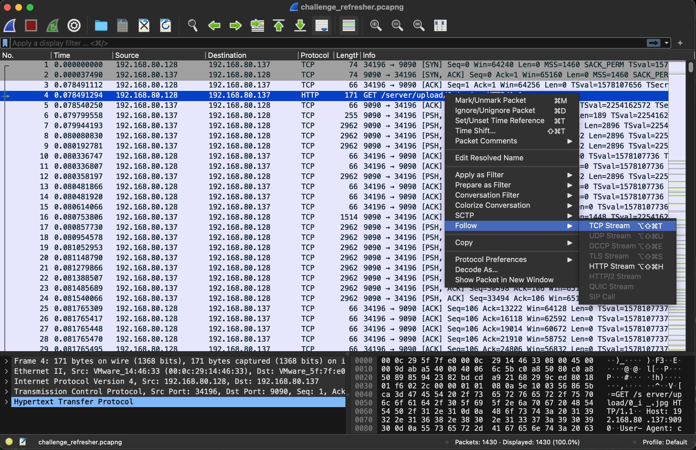
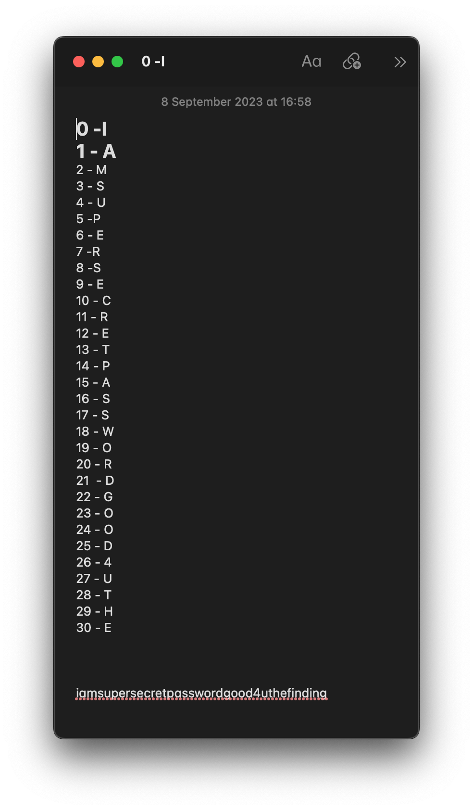
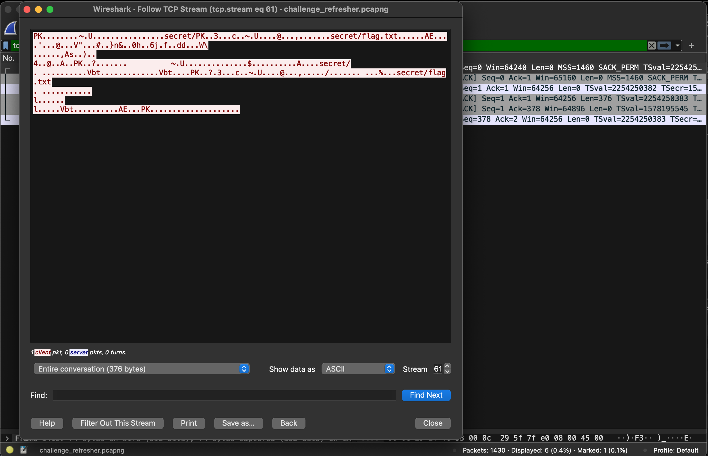
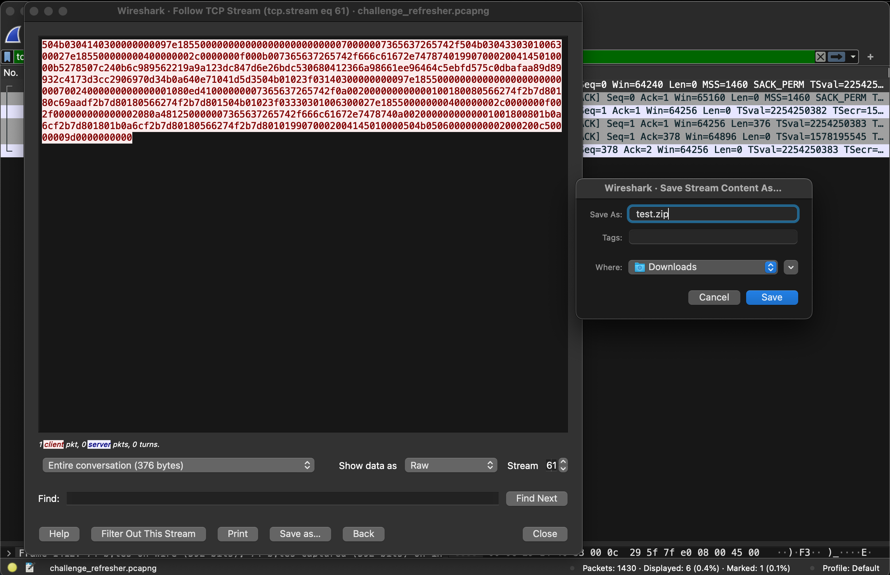
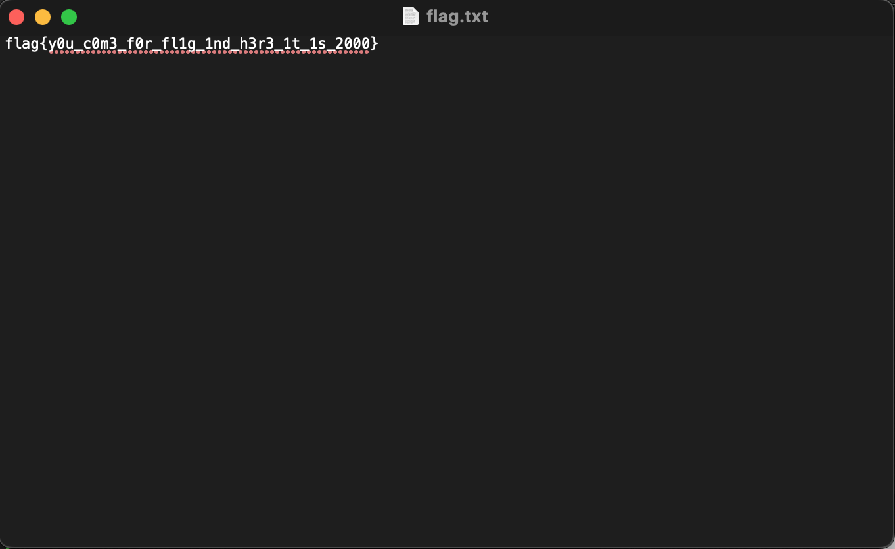

# Category
Network Security
# Description
let's refresh your skills  >_<  
[FILE](./challenge_refresher.pcapng)
# Solution 
download the file 
open it with wireshark  
 
glancing through the packets I spotted a packet with an image upload.  
Following the tcp stream I saw a bunch of other packets like that with numbers an underscore and a letter after, leading me to assume that the number represents the order of the alphabet in a sentence. 
 
They did form a sentence – “iamsupersecretpasswordgood4uthefinding”. 
 
then later on we find out that in the same stream we have a .zip file transfer and the file is in a few packets later.  
We know that it is a zip file because of the packet header(file signature). Find out more about that [here](https://en.wikipedia.org/wiki/List_of_file_signatures). 
 
we change the format to raw and save the file.  
 
The zip file asks for a password and I input the string we found earlier and viola we get a .txt file containing the flag. 
 

A better way to have gone about this would have been to check the protocol hierarchy and we would have found the data packets earlier and gotten our zip file then go to export our http data objects and gotten the password. Easy as abc but as they say hindsight is always 20/20. 
# Flag
Flag: flag{y0u_c0m3_f0r_fl1g_1nd_h3r3_1t_1s_2000}