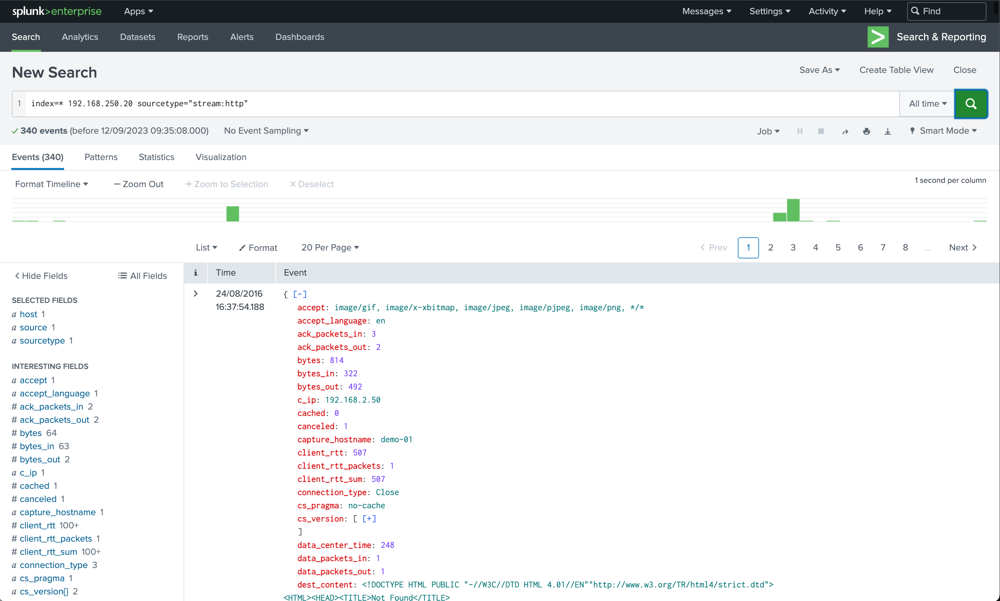
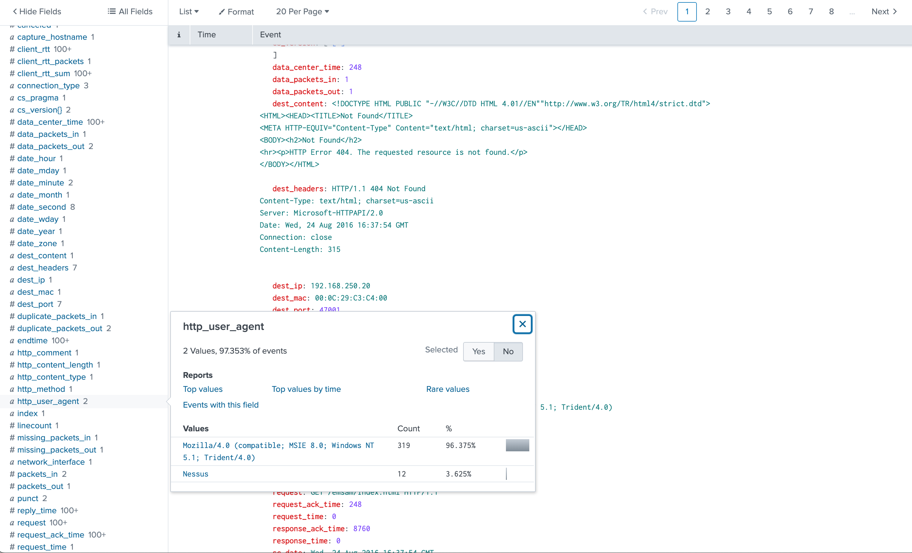

# Category
Digital Forensics
# Description
Our web server at 192.168.250.20 is being scanned by a famous vulnerability scanner, can you investigate the logs and tell us:  
X: the vulnerability scanner name 
Y: The Source IP → x.x.x.x 
Flag format: flag{X:Y} 
Link: http://54.215.227.222/en-GB/app/launcher/home 
Credentials: cybertalents/cybertalents  
# Solution
 Open the website 
 We search for activity that has to do with the ip address and because we are looking for scanning activity, it's most likely going to be scanning our webserver so we will search for http logs.  
 so we type in the following the search box. 
 >index= 192.168.250.20 sourcetype="stream:http"  

 
 We check the src_ip field and we find out that 100% of the traffic is from 192.168.2.50. Therefore our Y is 192.168.2.50 
 
 we probe deeper into the http logs between the two ip addresses above using the search query below
 >index= 192.168.250.20 sourcetype="stream:http" src_ip=192.168.2.50 

 we get the following when we check for the user agent. 
 
 From there we can determine that the scanner being used is nessus. Therefore X = Nessus
# Flag
flag{Nessus:192.168.2.50}