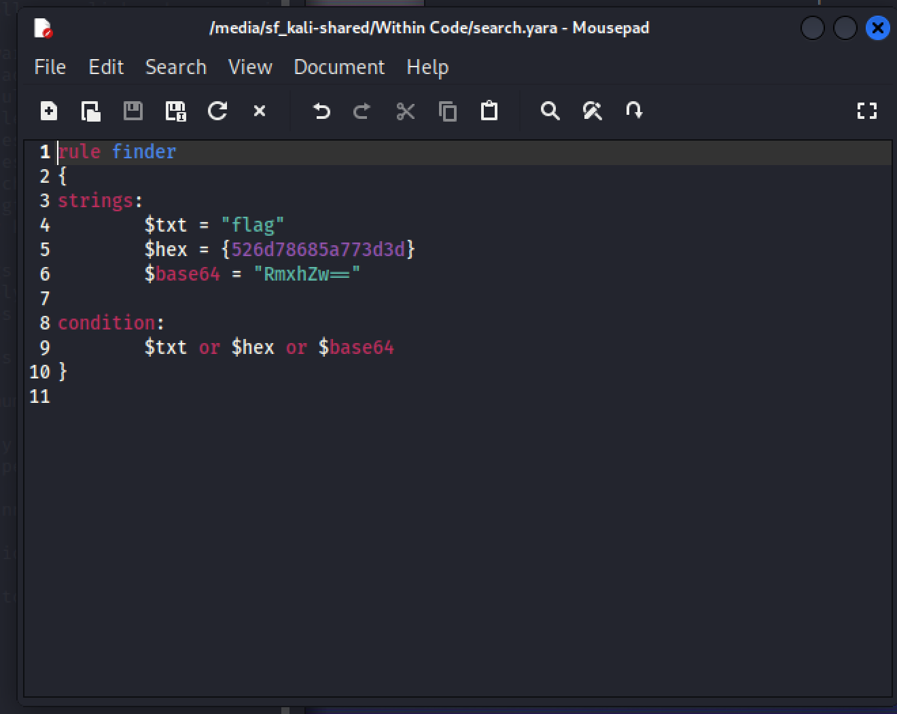
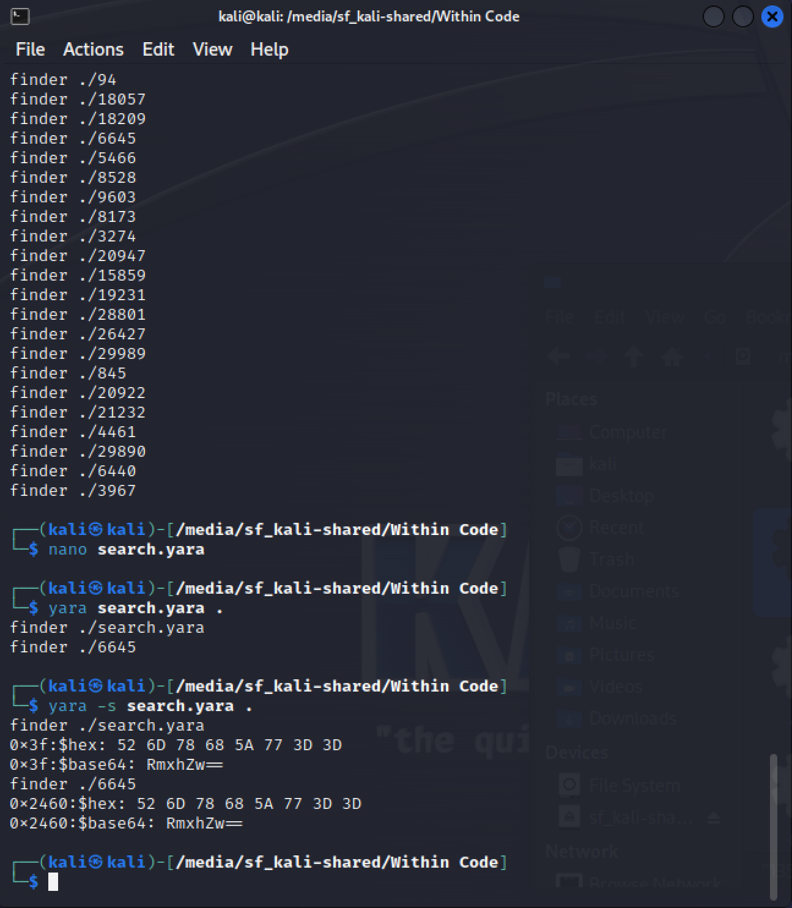

# Category
Digital Forensics
# Description
Flag rises within the code. Our developer thinks encoding is safe, try to find the location. </br>
flag format: Flag{location}</br>
[FILE](./within+Code.zip)
# Solution 
Download the file</br>
Uncompress the file</br>
We need to write a yara rule to find the flag. </br>
From the description we deduce that the flag is encoded so in our yara rule we include the 2 common types of encoding base 64 and hex</br> 
so we write the following rule:</br>

```“rule finder
 {
Strings:
	$base_64 = “RmxhZw==”
	$hex = {526d78685a773d3d}
Condition: 
	$base_64 or $hex
 }”```</br>

</br>

Save it with a .yara extentension.</br> 
It’s advisable to save it in the same folder as the other files so as to not deal with path issues when running the command </br>

Run ```yara -s [rule name] [target]```


The -s option gives us the location of the hex value or base64 value in the file. We get this</br>
the hex offset of the flag in the file ./6645 is 0x2460 </br>
Converting from hex doesn’t work then, I google searched the value and got a decimal value of 9312 from [here](https://unicodemap.org/details/0x2460/index.html)</br>

# Flag
flag{9312}