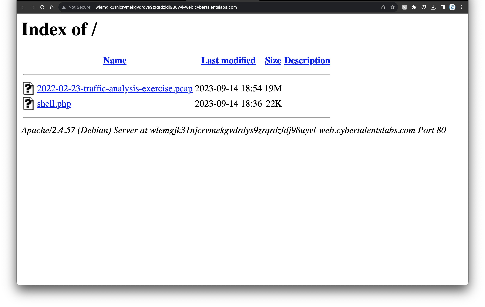
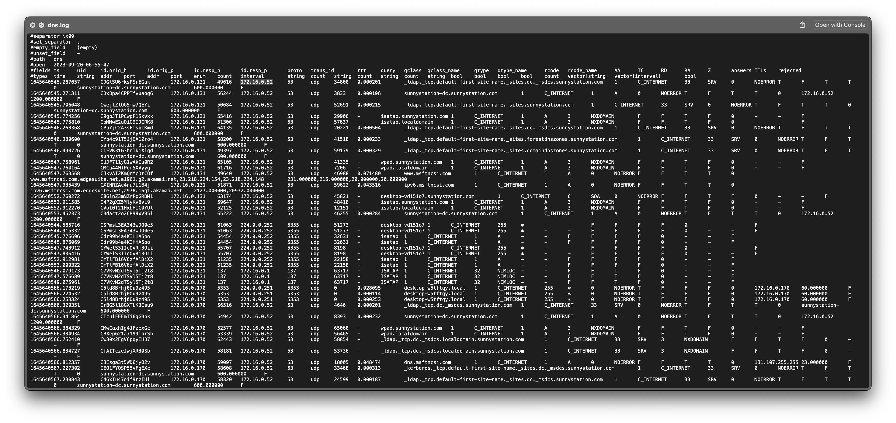
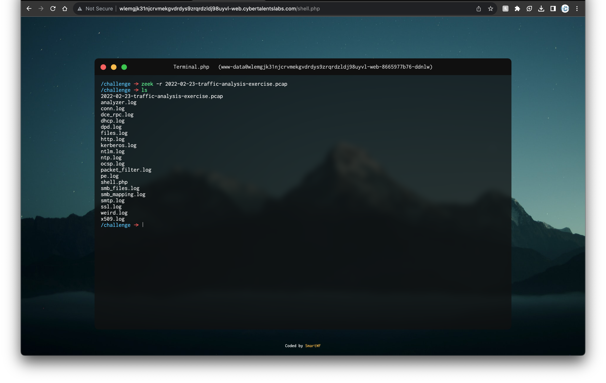
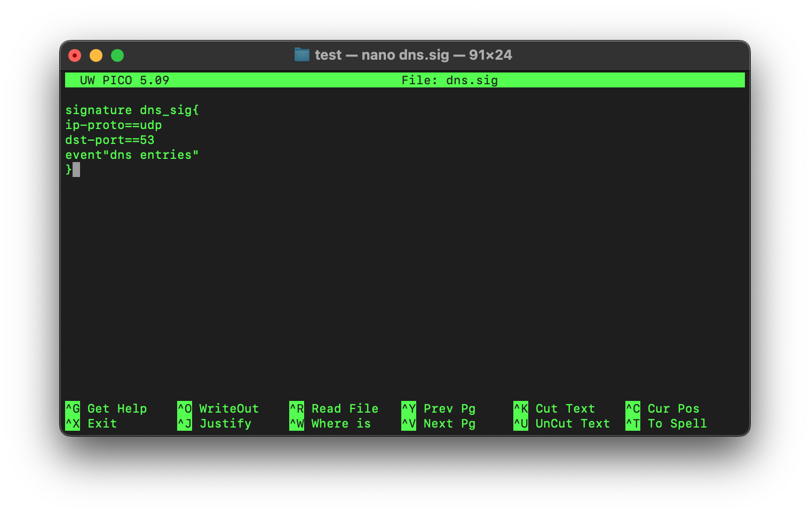
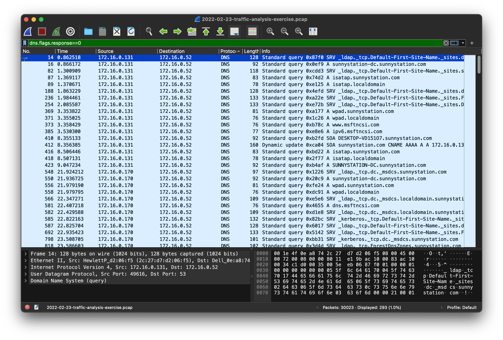

# Category
Network Security
# Description
Try to get the DNS IP.</br>
[PCAP](./2022-02-23-traffic-analysis-exercise.pcap) | [SHELL](./shell.php)</br>
Flag format: FLAG{DNS_IP}
# Solution 
</br>
method 1 </br>
click the link</br>
we get to a server page</br>

download both files</br>
upon further analysis the shell.php fiie seems to be a terminal emulator. #ignore</br>
using zeek to analyse the .pcap file by running ```zeek -r 2022-02-23-traffic-analysis-exercise.pcap```</br>
we get: </br>
we get a dns.log file</br>
opening the dns.log file we get this:</br>
</br>
from this we understand that the id.resp_h field gives the ip address of the dns server because it provides the response.[proof](https://docs.zeek.org/en/master/logs/dns.html) </br>
we get our flag to be 172.16.0.52</br>
</br>

<!-- method 2</br>
open the link given. we get to the same server page as before</br>
clicking the shell.php file opens up a terminal</br>
we use zeek to analyse the file by running:</br>
```zeek -r 2022-02-23-traffic-analysis-exercise.pcap```.</br> 
after doing that we find out that a dns.log file was not created so we have to write our own signature for that</br>


using that we  -->

method 2</br>
open the link.</br>
save the pcap file by rightclicking on it and clicking on "save link as".</br>
open it with wireshark.</br>
using this filter ```dns.flags.response==0``` we get all the dns request packets</br>
 and when you sort it out, the destination ip is 172.16.0.52 which is our dns server's ip address.</br>

# Flag
flag{172.16.0.52}